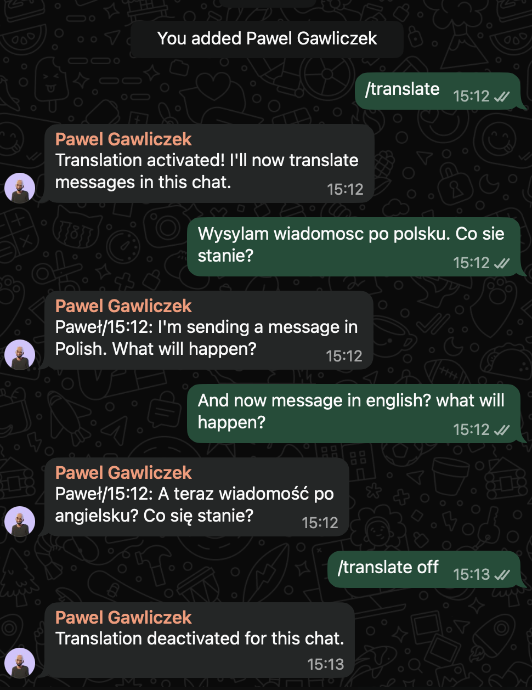

# whatsapp-translator

My Polish parents and my Egyptian wife share a WhatsApp group. For months I was the human relay -- every message needed rephrasing for the other side. My wife was screenshotting Polish messages and pasting them into Google Translate just to follow the conversation.

So I built a bot that sits in the group chat, detects the language of each message, and posts the translation. It uses [OpenWA](https://github.com/open-wa/wa-automate-nodejs) as a WhatsApp Web bridge, FastAPI for the webhook server, and OpenAI's `gpt-4o-mini` for the actual translation. The whole thing is about 380 lines of Python.

## How it works

```
WhatsApp message
  -> OpenWA bridge (receives message via WhatsApp Web)
  -> POST webhook to translator
  -> langdetect (detect language)
  -> OpenAI gpt-4o-mini (translate)
  -> POST back to OpenWA (send translated message)
```

Translation is opt-in. Send `/translate` in any chat to activate it. The bot stays quiet everywhere else.

<p align="center"></p>

## Setup

The bot needs to run on a machine that's always on -- a VPS, a home server, anything with Docker that stays connected. It links to a WhatsApp account via WhatsApp Web (QR code scan), so you need a spare phone number or a dedicated one for the bot. Once linked, add that account to whatever group chats you want translated.

### Prerequisites

- A server or always-on machine with Docker and Docker Compose
- An OpenAI API key
- A WhatsApp account for the bot (you'll link it via QR code)

### 1. Clone and configure

```bash
git clone https://github.com/pawelgawliczek/whatsapp-translator.git
cd whatsapp-translator
```

Create a `.env` file:

```
OPENAI_API_KEY=sk-your-key-here
OWNER_CHAT_ID=your-number@c.us
```

`OWNER_CHAT_ID` is your WhatsApp phone number in international format without the `+`, followed by `@c.us`. For example, if your number is +48 795 411 996, use `48795411996@c.us`. Messages from non-activated chats get forwarded here as notifications.

### 2. Docker network

The compose file expects an external network called `stack_appnet`. Create it if you don't have one, or change the networking in `docker-compose.yml` to suit your setup:

```bash
docker network create stack_appnet
```

### 3. Start the services

```bash
docker compose up -d
```

This starts two containers: `whatsapp-bot` (the OpenWA bridge, exposed on port 9001) and `wa-translator` (the FastAPI translation service, internal only).

### 4. Link your WhatsApp

Open `http://your-server:9001` in a browser. You'll see a QR code. Scan it with WhatsApp on your phone (Settings > Linked Devices > Link a Device).

Keep the session alive for at least 5 minutes before restarting anything, so the session data persists.

### 5. Add the bot to your chats

Add the bot's WhatsApp account to whatever group chats you want translated. Then send `/translate` in that chat to activate it. The bot will confirm and start translating.

## Commands

| Command | What it does |
|---|---|
| `/translate` | Activate translation in the current chat |
| `/translate off` | Deactivate translation in the current chat |
| `/dictionary add word1, word2` | Add a custom translation pair for this chat |
| `/dictionary list` | Show all custom pairs for this chat |
| `/dictionary remove word1, word2` | Remove a specific pair |
| `/dictionary remove word` | Remove all pairs containing that word |

### Custom dictionaries

OpenAI handles general text well, but sometimes you want specific words translated a certain way -- nicknames, inside jokes, technical terms. The `/dictionary` command lets you define per-chat word pairs that get injected into the translation prompt.

For example:

```
/dictionary add Babcia, Grandma
```

## Configuration

Environment variables in `docker-compose.yml`:

| Variable | Default | Description |
|---|---|---|
| `OPENAI_API_KEY` | (required) | Your OpenAI API key |
| `OPENAI_MODEL` | `gpt-4o-mini` | OpenAI model to use for translation |
| `OWNER_CHAT_ID` | (required) | Your WhatsApp number as `number@c.us` |
| `WA_API_BASE` | `http://whatsapp-bot:8002` | OpenWA API URL (change if using a different bridge) |
| `TZ` | `Africa/Cairo` | Timezone for message timestamps |

## Adapting for other languages

Right now the bot only handles Polish and English. Adding other languages is straightforward though -- it's just a few lines in the routing logic. Point [Claude Code](https://claude.ai/code) at the repo and tell it what languages you need. It'll sort it out.

To do it manually, edit the detection and routing in `translator/app/main.py`:

```python
if lang.startswith("en"):
    translated = translate(body, "Polish", context, dictionary=chat_dict)
elif lang.startswith("pl") or lang in POLISH_LIKE_LANGS:
    translated = translate(body, "English", context, dictionary=chat_dict)
```

Change `"Polish"` and `"English"` to your target languages, and update the `lang.startswith()` checks to match the ISO codes `langdetect` returns for your source languages.

The `POLISH_LIKE_LANGS` set handles cases where `langdetect` confuses short Polish text with similar Slavic languages. You may not need this for your language pair, or you may need a similar set for yours.

## Persistent state

The bot stores two files in `translator/data/` (mounted as a Docker volume):

- `active_chats.json` -- which chats have translation enabled
- `dictionaries.json` -- per-chat custom word pairs

These survive container restarts. Message history (used for translation context) is in-memory only and is lost on restart.

## Troubleshooting

**Bot isn't translating messages**

Check if webhooks are arriving:

```bash
docker compose logs --tail=30 translator
```

Look for `[MSG]` lines. If you see them but no `[TRANSLATE]` lines, the chat probably isn't activated (send `/translate`).

If there are no `[MSG]` lines at all, the OpenWA bridge may have stopped sending webhooks. Restart it:

```bash
docker compose restart whatsapp-bot
```

**WhatsApp session expired**

If the bot stops working after a long time, the session may need re-linking:

```bash
docker exec whatsapp-bot rm -rf /sessions/_IGNORE_session/*
docker compose restart whatsapp-bot
```

Then scan the QR code again at `http://your-server:9001`.

**Wrong language detected**

`langdetect` can misidentify short messages. The bot already handles common Polish/Slavic confusion, but very short texts (1-2 words) may get the wrong language. Longer messages are detected reliably.

## Security

The OpenWA bridge on port 9001 is a full WhatsApp API. If your server is internet-facing, put this behind auth (basic auth via reverse proxy, IP allowlist, or VPN). Without that, anyone who finds the port can send messages as your account.

Message content goes to OpenAI for translation. The bot ignores its own messages (no loops) and skips all media.

## Blog post

I wrote about the background and how this came together: [How I built a WhatsApp translator so my family could actually talk to each other](https://pawelgawliczek.cloud/blog/family-chat-translator)

## License

MIT
